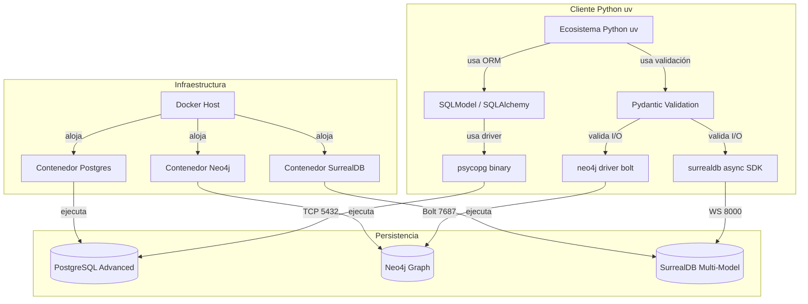

# Modelo Semántico de Datos: Ecosistema Polyglot DB

Este documento sirve como "gemelo digital" o modelo semántico general para el ecosistema de experimentación de bases de datos. El objetivo es estructurar las relaciones conceptuales entre la infraestructura, las tecnologías de persistencia de datos, y los lenguajes de programación o clientes, facilitando su entendimiento global y su reproducibilidad.

---

## 1. Ontología / Taxonomía Conceptual

El sistema se compone de tres dominios o niveles principales:

1. **Dominio de Infraestructura (`InfrastructureLayer`)**
   - **DockerHost**: El entorno subyacente que levanta los servicios.
   - **ContainerizedService**: Instancias aisladas (Postgres, Neo4j, SurrealDB).

2. **Dominio de Persistencia (`PersistenceLayer`)**
   - Define el paradigma tecnológico de cada base de datos:
     - *RelationalStore*: PostgreSQL.
     - *VectorStore*: PostgreSQL (vía `pgvector`).
     - *GraphStore*: Neo4j.
     - *MultiModelStore*: SurrealDB.

3. **Dominio de Aplicación / Cliente (`ApplicationLayer`)**
   - **ProjectContext**: Entorno `uv` (Gestor de dependencias de Python).
   - **DataModels**: Validadores semánticos del dominio local (ej. Pydantic, SQLModel).
   - **DatabaseDriver**: Protocolos de conexión asíncronos y síncronos (WebSockets, Bolt, TCP/HTTP).

---

## 2. Grafo de Relaciones Conceptuales (Diagrama Mermaid)

El siguiente diagrama de grafos (Entity-Relationship Network) representa cómo se ensambla el proyecto a nivel conceptual.



---

## 3. Modelo Semántico Procesable (YAML)

El siguiente bloque proporciona la estructura anterior en un formato YAML estandarizado. Puede utilizarse como metadato, inyectarse en bases de datos de grafos, o utilizarse por LLMs (RAG) para "reproducir o relacionar" este proyecto con futuros proyectos similares.

```yaml
schemaVersion: 1.0.0
project:
  name: "Polyglot Database Learning Environment"
  rootPath: "/myLearnings"
  description: "Entorno de aprendizaje y experimentación combinando múltiples paradigmas de persistencia y clientes en Python tipado."

ontology:
  infrastructure:
    orchestrator: "Docker Compose"
    services:
      - name: "postgres"
        image: "pgvector/pgvector:16"
        port: 5432
        capabilities: ["Relational", "Vector", "JSON", "Full-Text Search"]
      
      - name: "neo4j"
        image: "neo4j:5"
        port: 7687
        capabilities: ["Graph", "Cypher"]
      
      - name: "surrealdb"
        image: "surrealdb/surrealdb:latest"
        port: 8000
        capabilities: ["Multi-Model", "Document", "Graph", "Time-Series"]

  application:
    environment:
      runtime: "Python 3.x"
      packageManager: "uv"
      path: "python_db_clients"
    libraries:
      - name: "sqlmodel"
        purpose: "ORM and data validation for Postgres"
        type: "DataModel"
      - name: "pydantic"
        purpose: "Strict schema validation for schemaless/graph DBs"
        type: "DataModel"
      - name: "psycopg"
        purpose: "PostgreSQL Database Driver"
        type: "Driver"
      - name: "neo4j"
        purpose: "Graph Database Driver via Bolt protocol"
        type: "Driver"
      - name: "surrealdb"
        purpose: "SurrealDB Async SDK Driver via WebSockets"
        type: "Driver"

relationships:
  - source: "python_db_clients"
    target: "postgres"
    relation: "CONNECTS_TO"
    protocol: "TCP"
    via: "psycopg"
    modelType: "sqlmodel"
  
  - source: "python_db_clients"
    target: "neo4j"
    relation: "CONNECTS_TO"
    protocol: "Bolt"
    via: "neo4j (driver)"
    modelType: "pydantic"
  
  - source: "python_db_clients"
    target: "surrealdb"
    relation: "CONNECTS_TO"
    protocol: "WebSocket"
    via: "surrealdb (async driver)"
    modelType: "pydantic"
```
