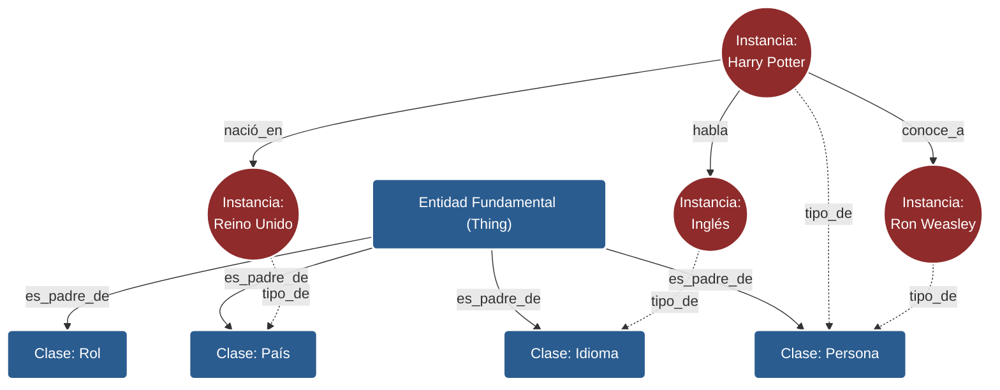

# Modelado de Conocimiento: Apuntes de Estudio

Estos apuntes sintetizan los fundamentos, componentes y aplicaciones del Modelado de Conocimiento, estructurados para un aprendizaje progresivo y riguroso.

---

### 1. CONCEPTO

El **Modelado de Conocimiento** (Knowledge Modelling) es la disciplina encargada de capturar, organizar y representar la esencia y configuración de un dominio específico para que pueda ser interpretado tanto por humanos como por máquinas. A través del uso de **ontologías** —definidas clásicamente como una "especificación formal y explícita de una conceptualización compartida"—, transforma información desestructurada o abstracta en modelos lógicos estructurados.

Su objetivo fundamental es facilitar la **interoperabilidad semántica**: no solo conectar sistemas (integración), sino asegurar que el significado y el contexto de la información se comparta y comprenda sin ambigüedades. Esto permite desarrollar sistemas de inteligencia artificial, procesamiento de lenguaje natural y grafos de conocimiento capaces de razonar, inferir relaciones y resolver problemas complejos de forma autónoma.

En su núcleo, el modelado de conocimiento actúa como un plano arquitectónico. Al igual que un plano guía la construcción de múltiples edificios, un modelo de conocimiento abstrae y formaliza la realidad mediante entidades, propiedades y reglas lógicas, habilitando la reutilización del conocimiento y mitigando el alto coste asociado a la pérdida de capital intelectual dentro de cualquier organización.

---

### 2. IDEAS CLAVE

* **Conocimiento (Explícito, Tácito, Implícito):** El explícito se documenta fácilmente; el tácito reside en la experiencia y es difícil de expresar; el implícito está en la mente humana pero puede articularse si es necesario (ej. mediante entrevistas a expertos).
* **Jerarquía DIKW:** La progresión natural de los **Datos** (símbolos sin contexto) a **Información** (datos contextualizados), luego a **Conocimiento** (información aplicada con habilidades) y finalmente a **Sabiduría** (conocimiento maduro y a largo plazo).
* **Ontología:** El artefacto central del modelado de conocimiento. Es un "plano" formal, derivado del consenso, que define los conceptos de un dominio y sus relaciones.
* **Instancias y Clases:** Las **instancias** (individuos) son ocurrencias específicas (ej. "Harry Potter"), mientras que las **clases** (conceptos o categorías) son agrupaciones lógicas que definen los requisitos de pertenencia.
* **Relaciones y Triples:** Las **relaciones** son el "pegamento" entre entidades. Un sujeto, una relación y un objeto forman un **triple**, la unidad fundamental para describir conocimiento.
* **Taxonomía y Herencia:** Las clases se organizan en una estructura jerárquica (taxonomía) donde las clases "hijas" heredan los atributos y comportamientos de las clases "padre" de forma transitiva.
* **Niveles de Abstracción:** Las ontologías se dividen en **Fundacionales/Superiores** (conceptos universales), de **Nivel Medio** (orientadas a dominios amplios) y de **Nivel de Usuario** (específicas para un caso de uso exacto).
* **Rigor Matemático (Lightweight vs Heavyweight):** Las ontologías *ligeras* asumen que el significado se entiende a nivel humano (ej. diagramas visuales); las *pesadas* usan lenguajes lógicos formales (como OWL o RDF) para asegurar la coherencia interpretable por máquinas.

---

### 3. EXPLICACIÓN PROFUNDA

#### El Ciclo de Vida del Conocimiento y la Transición DIKW
La gestión del conocimiento se sitúa en la intersección entre personas, procesos y tecnología. Posee dos dimensiones clave: la **capa de innovación** (donde se crea nuevo conocimiento y se integra en sistemas para salir al mercado) y la **capa de compartición** (donde el conocimiento histórico y existente se captura, almacena y difunde para la resolución de problemas). Esta gestión es vital para ascender en la pirámide DIKW: contextualizamos los datos abstractos para convertirlos en información, los aplicamos cognitivamente para convertirlos en conocimiento reutilizable, culminando con la sabiduría.

#### Perspectiva Filosófica y Lógica
La palabra *ontología* proviene de la filosofía (el estudio fundamental del ser y la existencia). Mientras que la filosofía abstrae el mundo para encontrar una estructura universal, la ontología técnica o informática aplica este principio de disección para crear modelos sobre un "Universo de Discurso" particular. Para que una máquina comprenda este modelo de manera profunda, se requiere de un lenguaje de representación (como **OWL**, **RDF**, KIF) que se evalúa bajo tres métricas:
1. **Expresividad:** La riqueza y variedad de estructuras que ofrece el lenguaje.
2. **Semántica:** La claridad y falta de ambigüedad del significado en su especificación.
3. **Rigor Matemático:** La capacidad del lenguaje de sostener la **satisfacibilidad** (que una declaración sea lógicamente posible) y la **coherencia** (la consistencia global del modelo sin contradicciones lógicas).

#### Bloques de Construcción del Modelo
La arquitectura de una ontología se sostiene sobre varios pilares de construcción:
* **Instancias (Individuos):** Representan los objetos reales (el monitor, una persona en concreto, un país).
* **Clases (Conceptos):** Abstracciones lógicas que agrupan a los individuos (Dispositivos, Personas, Países).
* **Relaciones:** Conexiones direccionales que forman afirmaciones lógicas o *triples* (Ej: Persona -> habla -> Idioma).
* **Axiomas/Reglas:** Restricciones matemáticas (Ej: "Toda persona debe tener un número de seguridad social").
La agrupación de clases en una **taxonomía** habilita la magia de la **herencia**, permitiendo que las propiedades fluyan desde lo general a lo particular de manera automática y minimizando la duplicación de definiciones.

#### Niveles de Abstracción y Aplicaciones
Las ontologías operan en diferentes niveles. Las **Ontologías Fundacionales** (ej. BFO, SUMO) definen nociones amplias de espacio, tiempo o materia y requieren esfuerzo académico global. Las de **Nivel Medio** estructuran dominios amplios (ej. The Zachman Framework para procesos empresariales). Finalmente, las ontologías de **Nivel de Usuario** modelan requerimientos de negocio exactos y diarios. Esta arquitectura escalable potencia la Web Semántica, el Procesamiento de Lenguaje Natural (NLP), la interoperabilidad de sistemas heterogéneos y, sobre todo, la implementación de **Enterprise Knowledge Graphs** (Grafos de Conocimiento Empresarial).

---

### 4. 3 EJEMPLOS

*   **Simple (Jerarquía y Taxonomía Cotidiana):**
    Imagina la estructura de directorios de tu ordenador personal. Tienes una carpeta genérica llamada "Documentos", dentro de la cual tienes "Facturas" y "Recibos". Has creado de forma intuitiva una taxonomía ligera (*lightweight ontology*). Por definición lógica, todo lo que esté en la carpeta "Facturas" hereda la característica de ser un "Documento".
*   **Intermedio (Modelo de Dominio de Empresa con Herencia):**
    Construimos una ontología explícita para la intranet de un departamento financiero. Definimos la **Clase** "Documento de Empresa" que tiene una regla estricta: *todo documento de empresa debe tener al menos un autor y una fecha de creación*. Luego creamos la subclase "Documento de Gastos". Gracias a la **herencia transitiva**, si instanciamos "Factura_Agosto_2024" como Documento de Gastos, el modelo hereda automáticamente que debe tener un autor y fecha, garantizando la integridad de los datos.
*   **Complejo (Grafo de Conocimiento y Motor Lógico):**
    Una corporación implementa un **Enterprise Knowledge Graph** programado en **OWL** (una ontología pesada o *heavyweight*). Se modelan clases de turbinas de avión, jerarquías de componentes y axiomas lógicos de fallo. Si un sistema transaccional emite que una pieza supera los 150 grados (datos en tiempo real), el motor lógico cruza esto con la ontología, infiere qué procesos dependen de esa pieza y alerta semánticamente al equipo de mantenimiento de que el evento precede a un fallo crítico en cadena.

---

### 5. DIAGRAMA/VISUAL

A continuación, un diagrama que ilustra los componentes fundamentales (Clases, Instancias y Triples) de un modelo de conocimiento:

> **Nota de lectura:** Las cajas azules representan la taxonomía (nivel abstracto), los círculos rojos representan las instancias (nivel concreto), y las flechas sólidas rojas entre círculos representan los "triples" que forman el conocimiento relacional.

---

### 6. ERRORES COMUNES

*   **Error 1: Crear taxonomías basadas en estados temporales o roles efímeros.**
    *   *Qué sale mal:* Clasificar la clase fundamental "Persona" directamente en subclases como "Estudiante", "Profesor" o "Empleado". Una persona puede ser estudiante y empleado simultáneamente, o dejar de serlo en el futuro, rompiendo la jerarquía y causando conflictos de instanciación.
    *   *Cómo evitarlo:* Modelar las clases basándose en atributos permanentes y naturales. Crear una clase fundamental "Persona" y otra clase independiente llamada "Rol". Luego, unir a la Persona con el Rol (ej. "Estudiante") mediante una relación a nivel de instancia.
*   **Error 2: Confundir Integración de Sistemas con Interoperabilidad Semántica.**
    *   *Qué sale mal:* Asumir que porque se envían datos entre dos bases de datos usando APIs (integración), el software destinatario comprende lo que está recibiendo. Se transfiere el dato, pero se pierde el contexto, causando asunciones erróneas.
    *   *Cómo evitarlo:* Aplicar ontologías explícitas que actúen como capa intermedia, garantizando que el significado profundo de la información se comparta junto con el dato (interoperabilidad).
*   **Error 3: Usar herramientas gráficas para casos de inferencia lógica de máquinas.**
    *   *Qué sale mal:* Diseñar un modelo visual de alta calidad en diagramas (Lightweight) y sorprenderse de que un software de inteligencia artificial no sea capaz de derivar deducciones o descubrir nuevo conocimiento automáticamente.
    *   *Cómo evitarlo:* Recordar que las máquinas requieren rigor matemático. Para IA y bases de conocimiento complejas, los modelos deben transcribirse a ontologías *Heavyweight* usando lenguajes basados en lógicas formales (como OWL o CL).

---

### 7. PREGUNTAS DE AUTOEVALUACIÓN

1.  **¿Cuál es la diferencia primordial entre conocimiento tácito e implícito?**
    *   *Respuesta:* El tácito se deriva orgánicamente de la experiencia, la intuición y habilidades internas, siendo extremadamente complejo de verbalizar. El implícito, aunque reside en nuestras cabezas y no está escrito, puede articularse, capturarse y exteriorizarse intencionalmente si se emplean métodos adecuados de entrevista.
2.  **Según el consenso académico (derivado de Gruber y Studer), ¿qué es exactamente una ontología?**
    *   *Respuesta:* Es "una especificación formal y explícita de una conceptualización compartida". Es un plano acordado que formaliza un tema para que sea legible tanto por humanos como por sistemas informáticos.
3.  **En el diseño de modelos, ¿qué forma un "triple" o "declaración" (statement) y por qué es relevante?**
    *   *Respuesta:* Un triple está formado por dos individuos/entidades unidos por una relación (Sujeto $\rightarrow$ Relación $\rightarrow$ Objeto). Es vital porque constituye la unidad de conocimiento fundamental sobre la que se construyen los grafos de conocimiento.
4.  **¿Por qué es fundamental la "herencia" en el diseño de una taxonomía de clases?**
    *   *Respuesta:* Al ser una relación transitiva, permite que una clase "hija" o subordinada herede inmediatamente todos los atributos, características y reglas lógicas declaradas en sus clases "padre", facilitando un modelo escalable y libre de contradicciones.
5.  **¿Qué separa a una ontología de Nivel Medio (Middle level) de una ontología de Nivel de Usuario (User level)?**
    *   *Respuesta:* Las ontologías de nivel medio definen conceptos amplios y reutilizables en múltiples sectores industriales (por ejemplo, cómo representar un "evento" en el tiempo o un proceso de producción genérico). Las de nivel de usuario están restringidas al contexto ultra-específico de un departamento o aplicación en particular.
6.  **¿Cómo contribuyen las ontologías al campo del Procesamiento del Lenguaje Natural (NLP)?**
    *   *Respuesta:* Proveen a los algoritmos de NLP del contexto, las jerarquías de términos y los significados necesarios para la minería de textos y la extracción de conceptos, mejorando drásticamente el entendimiento de la intención y semántica del lenguaje humano.
