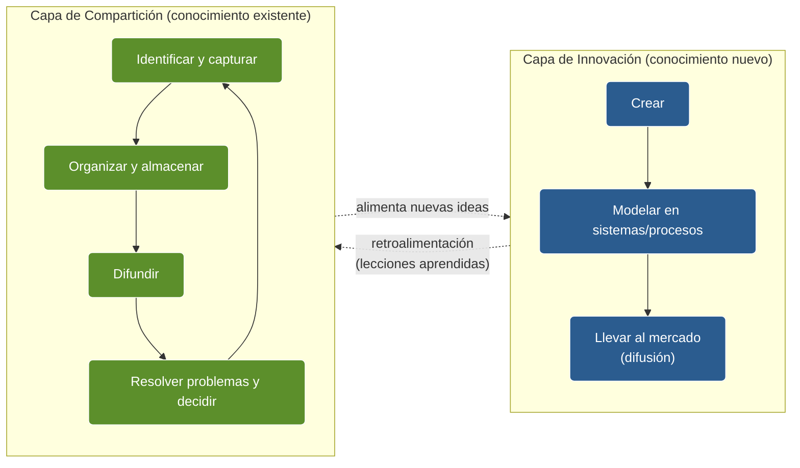
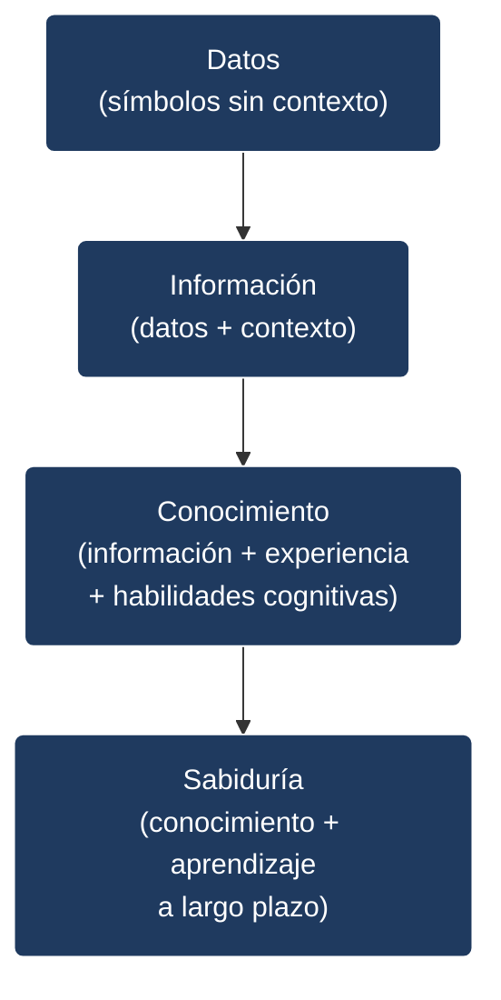
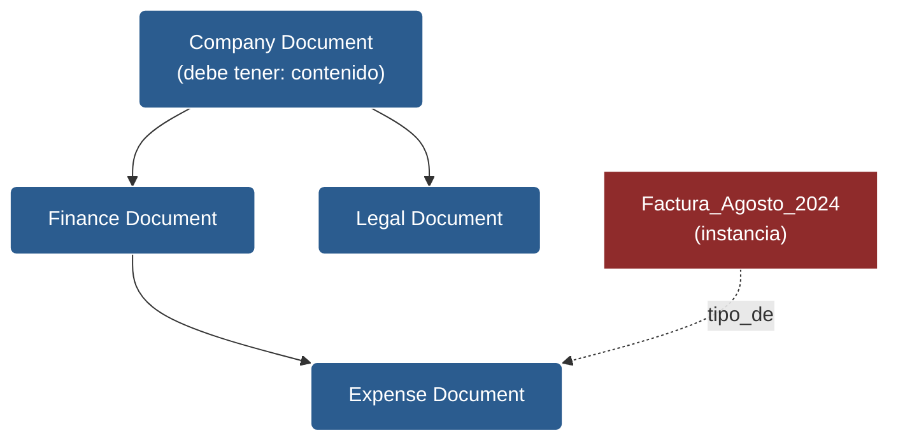
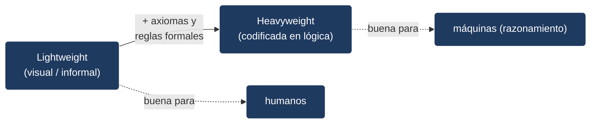
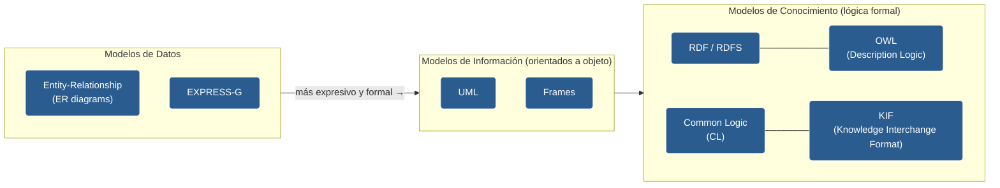
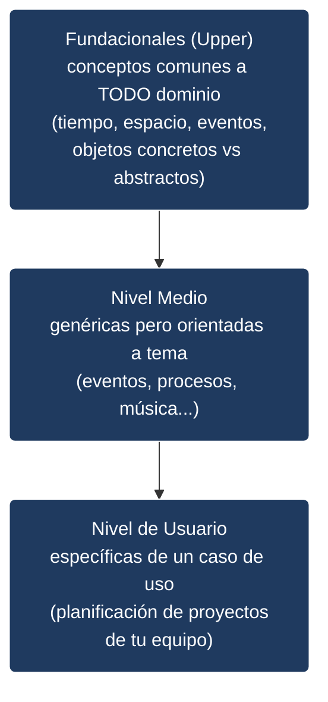

# Tema 0 — Introducción al Modelado de Conocimiento

> **Versión mejorada e integrada de los apuntes.** Sintetiza fielmente las 10 lecciones de la carpeta `raw/0_Introduction_to_knowledge_modelling/`, corrige imprecisiones detectadas en versiones anteriores, completa las aplicaciones omitidas y añade diagramas para los conceptos clave.

---

## 0. Mapa del tema


**Pregunta-guía del tema:** *¿Cómo pasamos de datos sueltos a sistemas capaces de razonar sobre un dominio compartiendo significado entre humanos y máquinas?*

---

## 1. Gestión del conocimiento y por qué importa

La **gestión del conocimiento** es la disciplina que articula **personas, procesos y tecnología** para entregar *la información adecuada, en el momento y lugar adecuados, a la audiencia correcta y en el formato adecuado*. Su valor económico es doble: por un lado, **transforma conocimiento individual en colectivo** (y reutilizable); por otro, **mitiga el coste de perder conocimiento** cuando una persona o equipo abandona la organización (costes de formación, errores repetidos, decisiones lentas).

### 1.1 Tipos de conocimiento

| Tipo | Naturaleza | Captura | Ejemplo |
|---|---|---|---|
| **Explícito** | Formal y sistemático | Fácil de identificar, almacenar y compartir | Un artículo de Wikipedia, un manual, un vídeo formativo |
| **Tácito** | Experiencia personal + intuición | **Muy difícil** de externalizar | El "ojo clínico" de un mecánico veterano para detectar averías |
| **Implícito** | Reside en la mente, no escrito | **Difícil pero posible** mediante elicitación (entrevistas, observación) | El método de un productor musical para masterizar una pista |

> **Aclaración importante (corrige imprecisión frecuente):** el tácito y el implícito **no son sinónimos**. El curso se aplica bien tanto al **explícito** como al **implícito**; el tácito puro queda fuera del alcance porque no es directamente articulable.

### 1.2 Ciclo de vida del conocimiento — dos capas conectadas



- **Capa de innovación:** captura el ciclo del **conocimiento nuevo** (ej. diseñar un hervidor revolucionario: idea → modelo → producto en el mercado).
- **Capa de compartición:** se ocupa del **conocimiento ya existente**: identificarlo, organizarlo, difundirlo y usarlo para resolver problemas.
- Ambas capas se retroalimentan: lo aprendido fabricando el hervidor anterior mejora el próximo.

La gestión del conocimiento se sitúa **en el centro de ese ciclo**, sosteniéndose sobre los tres pilares: **personas, procesos y tecnología**.

---

## 2. De los datos a la sabiduría: la jerarquía DIKW

**Pregunta-guía:** *¿En qué punto un símbolo se convierte en algo útil para tomar decisiones?*



Ejemplo del curso (te incorporas a un trabajo nuevo con una hoja de cálculo):

1. **Datos.** El primer día las celdas son símbolos sin propósito claro.
2. **Información.** A las dos semanas reconoces el contexto: los datos ahora tienen sentido y aportan valor.
3. **Conocimiento.** Tras unos meses combinas esa información con experiencia y habilidades para obtener resultados concretos y puedes **compartir** lo aprendido.
4. **Sabiduría.** Con el tiempo el conocimiento se integra con aprendizaje a largo plazo e insights.

> **Matiz fiel a la fuente:** la transcripción dice que la sabiduría es donde "se sitúa" el conocimiento tácito — es decir, la sabiduría suele ser tácita por naturaleza, no que la sabiduría *sea* el tácito. La progresión DIKW es **inevitable** si queremos sistemas más inteligentes.

---

## 3. ¿Qué es un modelo de conocimiento?

### 3.1 La intuición: un mapa mental con superpoderes

Un **mapa mental** organiza ideas alrededor de un tema central y sirve para compartir la interpretación entre humanos. Si:

1. Re-ordenamos esas ideas **prestando atención a las relaciones** entre ellas, y
2. Lo hacemos de forma que sea **interpretable tanto por humanos como por máquinas**,

obtenemos un **modelo de conocimiento** (o **ontología**). Un mapa mental con estructura formal suficiente para que su significado quede autodescrito.

> *"Una imagen vale más que mil palabras, pero un **modelo** vale mucho más."*

### 3.2 Definiciones académicas

| Autor / Año | Definición |
|---|---|
| **Gruber, 1993** (*A Translation Approach to Portable Ontologies*) | "Una especificación explícita de una conceptualización." |
| **Studer et al., 1997** | "Una especificación **formal y explícita** de una conceptualización **compartida**." |

**Lectura desglosada de Studer:**
- **Formal** → interpretable por máquinas.
- **Explícita** → los conceptos y restricciones están declarados (no sobreentendidos).
- **Conceptualización** → modelo abstracto de algún fenómeno del mundo.
- **Compartida** → consensuada por una comunidad (no es la visión de un solo individuo).

### 3.3 Metáfora operativa: el plano

Trataremos una ontología como un **"plano" (blueprint) acordado** del conocimiento de un dominio. Igual que un plano puede usarse para construir varios edificios, un modelo de conocimiento puede aplicarse para:

- capturar **semántica** (significado),
- representar **dominios**,
- diseñar **sistemas**,
- crear **vocabularios controlados** y **tesauros**,
- modelar **empresas y procesos**,
- y muchos más usos.

---

## 4. Perspectiva filosófica de la ontología

La palabra *ontología* viene del griego: **estudio del ser y la existencia**. La ontología tradicional, rama de la **metafísica**, busca responder preguntas como:

- ¿Qué significa que algo exista?
- ¿Qué es una entidad y cómo la cualificamos/cuantificamos?
- ¿Cuáles son las características y rasgos de los entes?
- ¿Cuáles son las entidades y propiedades **más fundamentales** que permiten describir el mundo?

Desde esta óptica, ontología es **diseccionar y abstraer el mundo** para encontrar orden o estructura fundamental. La filosofía distingue ya entre **ontologías fundacionales** (conceptos comunes a todos los dominios) y ontologías más concretas — distinción que la informática hereda directamente en sus **niveles de abstracción** (sección 8).

> **Conclusión clave:** el modelado técnico de conocimiento **encaja en una tradición intelectual mucho más amplia**. La informática no inventó las ontologías; las operacionalizó.

---

## 5. Bloques de construcción de un modelo de conocimiento

Cinco elementos componen la anatomía de toda ontología: **instancias, relaciones, clases, taxonomías y axiomas**.

### 5.1 Instancias (individuos)

Una **instancia** es una ocurrencia única de algo: tu monitor, tu teléfono, una taza concreta de café, un personaje (Harry Potter, Ron Weasley), un país (Reino Unido), un idioma (Inglés, Pársel).

### 5.2 Relaciones y triples

Las **relaciones** son el "pegamento" entre instancias. Una relación con dirección entre dos entidades forma una **declaración** (*statement*) o **triple** — la **unidad fundamental** de almacenamiento de conocimiento:

```
Sujeto  →  Relación  →  Objeto
```

Ejemplos del corpus:
- `Ron  →  conoce_a  →  Harry`
- `Harry  →  nació_en  →  Reino Unido`
- `Harry  →  habla  →  Inglés`
- `Harry  →  habla  →  Pársel` *(el idioma con el que habla con la serpiente en la peli)*
- `Inglés  →  es_idioma_principal_de  →  Reino Unido`
- `Inglés  →  es_idioma_principal_de  →  EE.UU.`

### 5.3 Clases (conceptos, categorías, tipos)

Una **clase** es una descripción que especifica **los requisitos para que algo sea miembro de ella**. Sinónimos en la literatura: *concept*, *category*, *kind*, *type*.

> **Ejemplo de calibrado de definiciones:** si definimos *Persona* como "todo individuo capaz de interacción social", **otros primates podrían colar**. Si en cambio exigimos "tener número de la Seguridad Social", el criterio es radicalmente distinto. **Las definiciones modelan los límites del dominio.**

### 5.4 Taxonomía y herencia

Las clases se agrupan en estructuras tipo árbol llamadas **taxonomías** (también *class hierarchy*). Funcionan como una estructura de carpetas que agrupas porque comparten algo.

La taxonomía habilita la **herencia**: una subclase **extiende** a su clase padre y hereda sus atributos y comportamiento. La herencia es **transitiva**:



`Expense Document` deriva de `Finance Document`, que deriva de `Company Document` → `Expense Document` hereda **todos** los requisitos en cadena (incluido "tener contenido").

> **Antipatrón clásico (corregido frente a versiones anteriores):** modelar `Persona` con subclases `Estudiante`, `Empleado`, `Profesor`. Las personas cambian de rol, y una misma persona puede ser estudiante y empleada simultáneamente. **Solución correcta:** clase `Persona` separada de clase `Rol`, conectadas por una relación a nivel de instancia (`Persona —desempeña→ Rol`).

### 5.5 Axiomas y reglas

**Restricciones formales** sobre las relaciones, ej. "*toda persona habla al menos un idioma*". Son los que aportan **rigor matemático** y permiten razonamiento automático.

### 5.6 Dominio (o universo) de discurso

**Todo lo enunciado o supuesto** al modelar un tema (clases, relaciones, individuos, reglas) constituye el **domain of discourse** o **universe of discourse**. Es el "perímetro" semántico del modelo.

---

## 6. Cómo se representa: lightweight vs heavyweight

Hay **dos vías** para expresar un modelo de conocimiento:

### 6.1 Representación visual (lightweight)

Diagramas con cajas, círculos y flechas. **Asumen** que el significado de los símbolos se entiende sin ambigüedad. Excelentes para compartir entre humanos, pobres para que una máquina razone.

> Una ontología **lightweight** = "menos formal y rigurosamente codificada"; incluye los métodos gráficos.

### 6.2 Representación codificada (heavyweight)

Usa **lenguajes formales basados en lógica** para que las máquinas interpreten el modelo. Una ontología **heavyweight** conserva **todo lo de la lightweight** y además **añade axiomas y reglas formales** que clarifican el significado.



En el curso se combinan ambas: métodos gráficos **y** una aplicación GUI que codifica los modelos en **OWL** (Web Ontology Language).

---

## 7. Lógica formal: criterios para elegir un lenguaje

Tres criterios definen un **lenguaje de representación de conocimiento (KRL)**:

| Criterio | Significado | Pregunta que responde |
|---|---|---|
| **Expresividad** | Variedad de constructos disponibles (clases, jerarquías, n-arias, restricciones, etc.) | *¿Cuánto puedo decir sobre mi dominio?* |
| **Semántica** | Claridad del significado en la especificación del lenguaje | *¿Está libre de ambigüedad lo que escribo?* |
| **Rigor matemático** | Garantías de **satisfacibilidad** y **coherencia** | *¿Es lógicamente sólido lo que afirmo?* |

- **Satisfacibilidad:** existe alguna interpretación que hace verdadera la declaración.
- **Coherencia:** consistencia global, ausencia de contradicciones en el universo de discurso.

El nivel real de rigor depende del lenguaje, pero también de la **destreza del modelador** y de las **herramientas** de soporte.

### 7.1 Familia de lenguajes (completa, no sólo OWL)

Los lenguajes se distribuyen en un espectro de **expresividad/formalidad**:



- **Description Logic (DL):** RDF, RDFS, **OWL** (W3C, estándar abierto, comunidad activa, buen tooling). *Lenguaje principal del curso.*
- **First-Order Logic (FOL):** **Common Logic (CL)** (estándar ISO) y **KIF** (años 90).

**¿Por qué OWL?** Soporta clases, jerarquías, relaciones, axiomas e individuos; es estándar W3C; tiene editores maduros (Protégé); y dispone de razonadores.

> En el curso **no se exige codificar OWL a mano**, aunque puede hacerse si dominas su sintaxis. Se usará una GUI para construir ontologías que internamente se codifican en OWL.

---

## 8. Niveles de abstracción de las ontologías

Las ontologías se distribuyen en **un continuo de generalidad**. Una división útil:



### 8.1 Fundacionales (Foundational / Upper)

Capturan lo más fundamental: **objetos perdurables**, **eventos** que se extienden en el tiempo, **objetos concretos** (sólo en un lugar a la vez, como un todo) y **objetos abstractos** (no existen en un único lugar). Su construcción es lenta, requiere consenso entre especialistas y suele venir de proyectos académicos largos o de la **ISO**.

Ejemplos: **SUMO** (Suggested Upper Merged Ontology — búsqueda, lingüística, razonamiento), **DOLCE** (lenguaje natural y sentido común), **BFO** (Basic Formal Ontology), **gist** (Semantic Arts).

### 8.2 Nivel medio (Middle level)

Más enfocadas que las fundacionales, pero genéricas dentro de su tema. Reutilizables entre dominios. Ejemplo: una ontología de "eventos en el tiempo" puede aplicarse a planificación de proyectos, pedidos, eventos festivos.

Ejemplos: **PSL** (Process Specification Language, eventos discretos en ingeniería de producción), **Zachman Framework** (ontología empresarial genérica, más visual que formal), **The Music Ontology**.

### 8.3 Nivel de usuario (User level)

Lo más específico posible: el dominio exacto de tu equipo/empresa/aplicación. Ejemplo: una ontología de planificación de proyectos de software adaptada a tu departamento; modelos de interacción de motores a reacción; clasificación de patentes; tipos de mercancía.

### 8.4 ¿Tienes que usar siempre los tres niveles?

**No.** Depende de las necesidades. Pero conviene **conocer cómo se relacionan** tus entidades con las de los niveles superiores para que tu ontología sea coherente con nociones más amplias, sobre todo si vas a **fusionar varias ontologías de usuario** en un modelo unificado (ahí los niveles medio y fundacional aportan el "esqueleto" común).

> **Aviso:** algunas ontologías reales **caen entre dos niveles** (p. ej. fundacional + medio). No te obsesiones con la categorización; lo importante es que tu modelo **cumpla los requisitos** de tu caso de uso.

---

## 9. Aplicaciones del modelado de conocimiento (Applied Ontology)

La **applied ontology** es el campo de aplicación práctica. Las ontologías son **platform-agnostic** (independientes de las restricciones tecnológicas de los sistemas), lo que las convierte en el sustrato natural de la interoperabilidad.

### 9.1 Distinción crítica: **integración** vs **interoperabilidad semántica**

| Integración | Interoperabilidad semántica |
|---|---|
| Conecta sistemas para que **fluyan datos** | Permite **compartir información sin perder contexto ni significado** |
| Mueve bytes | Mueve **significado** junto con los bytes |
| APIs, ETL, mensajería | Ontologías como capa de semántica compartida |

### 9.2 Catálogo completo de aplicaciones

Estas son **las 13 aplicaciones** listadas en la fuente (`10_applications_knowledge_modelling_2.txt`) más las del audio (`9_applicatons_knowledge_modelling_1.txt`):

1. **Representación de conocimiento de dominio.** Modelos explícitos que llevan estructura, significado e información reutilizable. Pueden consultarse para responder preguntas de negocio y permiten "hacer zoom" sobre la complejidad.
2. **Modelado aumentado de procesos de negocio.** Procesos capturados como ontologías y grafos consultables.
3. **Representación de reglas de negocio.** Captura explícita que **evita el hard-coding** en aplicaciones; acelera descubrimientos y evaluaciones de impacto.
4. **Catálogos de datos semánticos.** Definición, alineamiento y curación de conceptos → buena **gobernanza del dato**.
5. **Visualizaciones topológicas versátiles.** Organigramas, linaje de datos, redes empresariales.
6. **Grafos de conocimiento empresarial (Enterprise Knowledge Graphs).** Bases que **unifican perspectivas** y aportan significado interpretable por máquina a todo tipo de dato corporativo. La ontología es **su plano**.
7. **NLP guiado por ontologías.** Contexto para *text mining*, extracción de conceptos, descubrimiento de relaciones.
8. **Datos enlazados (Linked Data / Linked Open Data).** Fundamento para describir grandes conjuntos abiertos. Ejemplo emblemático: **DBpedia**.
9. **Modelos de referencia.** Encarnan conocimiento experto compartido por una comunidad → base para estándares.
10. **Interoperabilidad semántica.** Intercambio de información autodescriptiva entre aplicaciones heterogéneas, con metadatos y documentación.
11. **Búsqueda semántica.** Ontologías y tesauros como "brújula" para inferir contexto desde las relaciones; búsqueda basada en intención.
12. **Activos visuales para enseñanza.** Visualizaciones interactivas para aprendizaje contextual y dirigido.
13. **Gestión de la complejidad.** Cadenas de suministro, ciclos de vida de productos, servicios financieros, **gemelos digitales** (motores a reacción, fábricas).
14. **Gestión de datos.** Aceleración de **Data Mesh**, descripción de **Data Fabric**, análisis de impacto de políticas, análisis de causa raíz.

> **Ejemplo concreto del curso:** una **base de conocimiento estructurada** sobre marcas de calderas combinadas. En invierno te falla el agua caliente pero la calefacción funciona; el grafo de conocimiento, configurado por la ontología, permite consultar y razonar para diagnosticar el problema.

### 9.3 De ontología a Knowledge Graph


Un **knowledge graph** = ontología (estructura) + miles/millones de individuos interconectados (datos). Pensado para *querying*, *reasoning* y *retrieval*. **Hay mucho solape entre las aplicaciones**: este tema sólo muestra un vistazo del alcance del campo.

---

## 10. Errores comunes y heurísticas de diseño

1. **Confundir integración con interoperabilidad.**
   *Síntoma:* "Ya tenemos APIs entre los dos sistemas, ¿para qué una ontología?"
   *Remedio:* la API mueve el dato; la ontología asegura que **el receptor entienda lo mismo** que el emisor.

2. **Modelar clases con roles efímeros.**
   *Síntoma:* `Persona → Estudiante, Empleado, Profesor`.
   *Remedio:* clase `Persona` + clase `Rol` separadas, unidas por relación a nivel de instancia.

3. **Esperar inferencia automática con un diagrama bonito.**
   *Síntoma:* "Tengo mi diagrama en Lucidchart pero el sistema no infiere nada."
   *Remedio:* los diagramas son **lightweight**; para razonamiento necesitas **heavyweight** (OWL, axiomas formales).

4. **Definir clases con criterios laxos.**
   *Síntoma:* "Persona = todo lo que interactúa socialmente" → entran chimpancés.
   *Remedio:* afinar los **requisitos de pertenencia** según el dominio (p. ej. "tiene NSS").

5. **Encerrarse en un único nivel de abstracción.**
   *Síntoma:* construir una ontología de usuario sin pensar en cómo se conecta con las nociones más amplias.
   *Remedio:* aunque no las uses directamente, **conoce** las fundacionales y de nivel medio; harán falta cuando integres ontologías.

6. **Confundir tácito con implícito.**
   *Síntoma:* prometer capturar la intuición artística de un experto.
   *Remedio:* lo que está en su cabeza pero **es articulable** es implícito (se puede elicitar); lo puramente tácito normalmente no.

---

## 11. Glosario express

| Término | Definición operativa |
|---|---|
| **Ontología** | Especificación formal y explícita de una conceptualización compartida (Studer, 1997). |
| **Dominio / universo de discurso** | Todo lo enunciado o supuesto al modelar un tema. |
| **Instancia / individuo** | Ocurrencia concreta de algo (Harry, Madrid, una factura). |
| **Clase / concepto** | Conjunto que define los requisitos para ser miembro. |
| **Relación** | Conexión direccional entre entidades. |
| **Triple / statement** | `Sujeto → Relación → Objeto`; unidad mínima de conocimiento. |
| **Taxonomía** | Jerarquía de clases en árbol. |
| **Herencia (transitiva)** | Una subclase hereda atributos y reglas de **todas** sus clases padre. |
| **Axioma / regla** | Restricción formal sobre el modelo. |
| **Lightweight ontology** | Representación informal (típicamente visual); asume comprensión humana. |
| **Heavyweight ontology** | Representación formal con lógica, axiomas y rigor matemático. |
| **Expresividad** | Riqueza de constructos del lenguaje. |
| **Semántica** | Claridad inequívoca del significado. |
| **Satisfacibilidad** | Existe una interpretación que hace verdadera la declaración. |
| **Coherencia** | Consistencia global del modelo. |
| **DL (Description Logic)** | Familia lógica detrás de RDFS/OWL. |
| **FOL (First-Order Logic)** | Familia lógica detrás de CL/KIF. |
| **Applied Ontology** | Campo de aplicación práctica del modelado de conocimiento. |
| **Knowledge Graph** | Ontología (esquema) + individuos interconectados (datos). |
| **Interoperabilidad semántica** | Compartir información preservando contexto y significado. |
| **DIKW** | Datos → Información → Conocimiento → Sabiduría. |

---

## 12. Autoevaluación

1. **¿Por qué importa la gestión del conocimiento desde un punto de vista económico?**
   *Mitiga el coste de perder conocimiento (formación, errores repetidos, decisiones lentas) y reutiliza el capital intelectual.*
2. **Diferencia entre tácito e implícito.**
   *El tácito procede de experiencia/intuición y es muy difícil de externalizar. El implícito vive en la mente pero **sí** puede articularse mediante elicitación.*
3. **Define DIKW con un ejemplo propio en una sola frase por nivel.**
   *(respuesta libre)*
4. **¿Qué añade Studer (1997) a la definición de Gruber (1993)?**
   *"Formal" (interpretable por máquinas) y "compartida" (consensuada por una comunidad).*
5. **¿Qué es un triple? ¿Por qué se considera la unidad fundamental del conocimiento?**
   *Una afirmación `Sujeto → Relación → Objeto`. Es la pieza mínima con la que se construyen grafos de conocimiento.*
6. **Explica la herencia transitiva con un ejemplo de tres niveles.**
   *Si `Expense Document` ⊆ `Finance Document` ⊆ `Company Document`, una instancia de `Expense Document` hereda los requisitos de los tres niveles.*
7. **¿Por qué `Persona → Estudiante/Empleado/Profesor` es un mal diseño y cómo se corrige?**
   *Los roles cambian y se solapan; mejor `Persona` + `Rol` separados, unidos por relación a nivel de instancia.*
8. **Tres criterios para elegir un KRL.**
   *Expresividad, semántica y rigor matemático (satisfacibilidad + coherencia).*
9. **¿Qué distingue una ontología lightweight de una heavyweight?**
   *La heavyweight conserva todo lo de la lightweight y añade axiomas y reglas formales codificados con rigor lógico, permitiendo razonamiento automático.*
10. **Coloca SUMO, PSL y "una ontología de gestión de incidencias de mi equipo" en su nivel de abstracción.**
    *SUMO = fundacional; PSL = nivel medio; mi ontología local = nivel de usuario.*
11. **Diferencia entre integración e interoperabilidad semántica con un ejemplo.**
    *Integración: dos sistemas intercambian JSON. Interoperabilidad: el receptor sabe que `temperature: 150` significa "grados Celsius medidos en la turbina del motor 3 a las 14:00" porque comparte la ontología.*
12. **¿Qué es un Knowledge Graph y qué papel juega la ontología en él?**
    *Un repositorio masivo de individuos interconectados; la ontología es su **plano/esquema** y aporta significado interpretable por máquina.*
13. **Nombra al menos cinco aplicaciones distintas del modelado de conocimiento.**
    *(libre — ver sección 9.2: representación de dominio, BPM aumentado, reglas de negocio, catálogos semánticos, EKG, NLP, Linked Data, búsqueda semántica, gemelos digitales, gestión de datos, etc.)*

---

## 13. Resumen en una pantalla

- **Gestión del conocimiento** = personas + procesos + tecnología, en dos capas (innovación / compartición) que se retroalimentan.
- **Conocimiento explícito, tácito, implícito.** El curso aplica al explícito y al implícito.
- **DIKW:** datos → información → conocimiento → sabiduría.
- **Ontología = mapa mental formal y compartido.** Definición de Studer.
- **Bloques:** instancias · relaciones (triples) · clases · taxonomía con herencia · axiomas · dominio de discurso.
- **Representación:** *lightweight* (visual, para humanos) ↔ *heavyweight* (codificada en lógica, para máquinas).
- **Lenguajes:** ER/UML (datos e información) → RDFS/**OWL** (DL) y CL/KIF (FOL). En el curso: **OWL** vía GUI.
- **Criterios de KRL:** expresividad, semántica, rigor matemático (satisfacibilidad + coherencia).
- **Niveles:** fundacional (SUMO, BFO, DOLCE, gist) → medio (PSL, Zachman) → usuario (tu departamento).
- **Aplicaciones (Applied Ontology):** EKG, NLP, Linked Data (DBpedia), búsqueda semántica, gobernanza/Data Mesh, gemelos digitales, BPM, reglas de negocio, gestión de complejidad…
- **Clave del campo:** la **interoperabilidad semántica** — compartir significado, no sólo datos.
